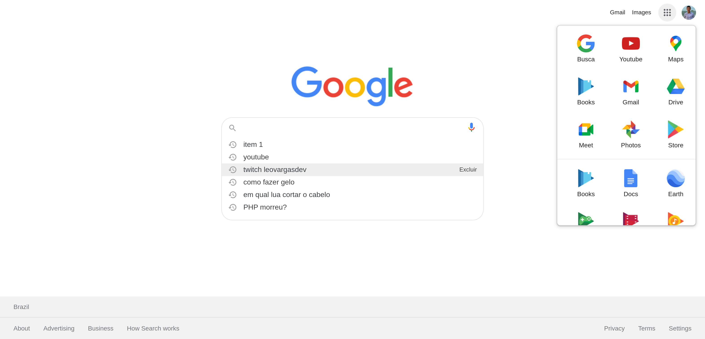

<h1 align="center">
  UI Clone - Google
</h1>

  
  
  
  
  

  
  
  

  

## 💻 Projeto

Este projeto é um tutorial que ensina a como recriar a interface do **Google** ao usar _HTML_ e _CSS_.

## 🚀 Tecnologias

- HTML
- CSS
- JavaScript

## 📔 Funcionalidades

- [x]  Uso semântico do HTML
- [x]  Uso de variáveis globais no `:root`
- [x]  Capturar o texto do input e buscar no **Google**
- [x]  Criar barra com o histórico das buscas
- [x]  Salvar as buscas no `localStorage`
- [x]  Criar o menu de aplicativos
- [x]  Evento para abrir/fechar o menu de aplicavos
- [x]  Responsividade

### Sugestão funcionalidades

- [ ]  Usar a função `createElement` nos filhos da âncora
- [ ]  Função para remover o item do histórico
- [ ]  Criar o menu do usuário
- [ ]  Fechar o menu de apps ao perder o foco

## Vídeos no youtube 

### #1 HOMEPAGE DO GOOGLE - ESTRUTURA DA PÁGINA | HTML CSS

---
### #2 HOMEPAGE DO GOOGLE - HISTÓRICO DE BUSCA, MENU APP E RESPONSIVIDADE | HTML CSS

